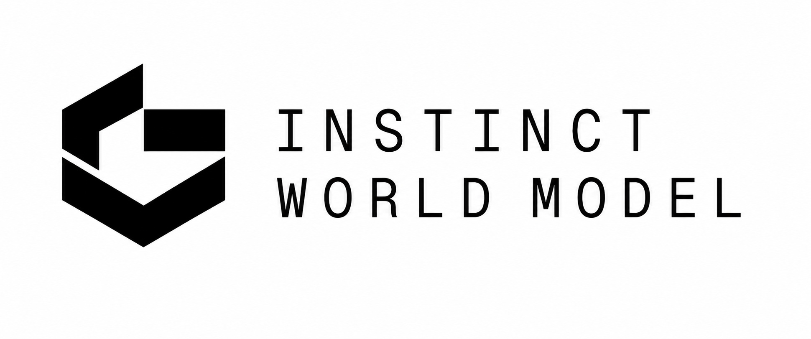

<div align="center">



### One runtime for robot world-action models

[](https://www.gnu.org/licenses/agpl-3.0)
[](https://general-instinct.com/)
[](https://www.ycombinator.com/companies/general-instinct)

[Architecture](ARCHITECTURE.md) •
[Checkpoints](CHECKPOINTS.md) •
[Quick Start](#quick-start) •
[Results](eval/lingbot_va_robotwin/RESULTS.md)

</div>

---

InstinctWM is an open platform for **world-action models** — robot policies that predict what
happens next *and* what to do about it in one model. You describe a model once; InstinctWM determines
which optimizations are legal for it, applies them, and reports what each one cost.

## One Runtime. Many Checkpoints. Shared Infrastructure.

Training recipes — PDD, DMD2, LCM, DreamZero — produce different **checkpoints**. They do not produce
different runtimes. There is one InstinctWM runtime, and it serves every compatible checkpoint by
reading what that checkpoint declares about itself.

There is no "fast runtime" and no "quality runtime". An operating point is a descriptor delta, not a
code path, and **the runtime never branches on the training method** — it consumes capabilities, so a
recipe that does not exist yet needs no change here. [How, and why →](ARCHITECTURE.md)

> **Status: early.** The evaluation pipeline, the measurement tooling, and the graph and cache
> layers are real and reproducible. The kernel and hardware layers are designed and being built.
> Every number here is measured on our own hardware with the scripts in [`eval/`](eval/).

---

## What's New 🔥

- **[2026/08]** Repository reorganized around the architecture rather than the build order: one
  directory per concept, [P001–P006 moved out of the public narrative](HISTORY.md), and the
  checkpoint contract written down. [Architecture →](ARCHITECTURE.md)
- **[2026/08]** **Fast operating point certified** at 2 video / 4 action steps: 566 matched pairs,
  0.910 vs a 0.929 teacher, non-inferior at a −0.05 margin (p = 0.0085). It is a descriptor delta,
  not a second checkpoint and not a second runtime.
- **[2026/08]** Graph capture **inverts between operating points** — profitable at Quality, a
  regression at Fast, breaking even near 41 forwards/cycle. The strongest argument yet for one
  runtime that computes profitability instead of two that hardcode it. [Why →](CHECKPOINTS.md)
- **[2026/08]** Step-allocation response surface mapped over 7 operating points, 3500 paired
  episodes, 50 tasks. Both streams tolerate 2 steps and both cliff at 1: **79 forwards/cycle down to
  4–6 is nearly free with no retraining at all.**
- **[2026/08]** **3.38× bit-exact** on LingBot-VA in episode mode: 9585 → 2832 ms per control
  cycle, at `max |Δ action| = 0`. [Protocol and full chain →](eval/lingbot_va_robotwin/RESULTS.md)
- **[2026/08]** Remaining cost profiled. LingBot-VA *was* launch-bound; after graph capture it is
  GPU-bound again, which re-ranks every layer below.
- **[2026/08]** Canonical RoboTwin 2.0 baseline: **91.6% macro**, 50 tasks, 2500 episodes.
- **[2026/07]** Evaluation pipeline for LingBot-VA on RoboTwin 2.0, including a prompt-parity gate
  that closes a silent train/serve mismatch.

---

## Optimization Stack

Six layers, ordered by *what they change*. **Layer 1 is training; Layers 2-6 are the runtime.**
Layer 1 produces checkpoints. Layers 2-6 produce plans. The layer number is not a priority order --
attention is Layer 4 and looks like the obvious first move, but it measures 7% of GPU-busy time.

| **MODEL** | **GRAPH** | **CACHE** | **ATTENTION** | **KERNEL** | **HARDWARE** |
|:--|:--|:--|:--|:--|:--|
| *what it computes* | *when work is issued* | *what is recomputed* | *how tokens mix* | *how a kernel is written* | *what it executes on* |
| Step Reduction | **Prefill Extraction** | **KV Reuse** | FlashAttention | **Operator Fusion** | TensorRT |
| Parallel Decoding Distillation | **Execution Graph Rewrite** | **Cross-Attention Cache** | FlashInfer | *Fused AdaLN* | FP8 |
| rCM | **CUDA Graph Capture** | **Episode Cache** | Sana-Video Hybrid | *Triton Kernels* | INT8 |
| sCM | **Persistent State Analysis** | TeaCache | LongSana | Fused CFG | INT4 |
| DMD2 | **Static Memory Planning** | XCache | Linear Attention | Fused Scheduler | Jetson |
| DreamZero-Flash | Stream Overlap | SeaCache | Mamba / DeltaNet | Fused VAE | Thor |
| Latent Compression | ~~CFG Parallelization~~ | Window Cache | | Paged KV Kernels | Snapdragon |
| DC-AE / DC-VE | ~~Whole-Cycle Capture~~ | Energy-based Cache | | | |

**bold** shipped, gated bit-exact, measured end to end · *italic* implemented but not on the shipped
path · ~~struck~~ rejected *by measurement*, kept so it is not re-proposed · plain designed only.

**All 3.38× of measured speedup comes from GRAPH and CACHE.** The other four layers are either
unbuilt or deprioritized *by profile*. Priority comes from the measurement at the operating point:
at Fast the warm cost model is `FIXED 1164 ms + 15.5 ms/forward` (R² = 0.994), so **93% of latency is
fixed overhead** and per-forward work is 7% of the problem. Per-pass measurements, protocols, and the
full chain are in [Results](eval/lingbot_va_robotwin/RESULTS.md).

---

## Quick Start

```bash
git clone https://github.com/general-instinct/InstinctWM && cd InstinctWM
pip install -e .                # analysis only: no torch, no GPU required
pip install -e ".[runtime]"     # to actually apply a plan and serve
```

Deciding *which* optimizations are legal is dependency-free by design, so you can inspect a plan on
a laptop. Only applying one needs torch.

```python
from instinctwm import load, Optimizer, Tier

model  = load("lingbot-va-posttrain-robotwin")
plan   = Optimizer(tier_ceiling=Tier.BITEXACT).compile(model.spec())
print(plan.explain())                    # what fired, and why
server = plan.serve(model, port=29056)   # deploy
```

`plan.explain()` reports every decision, including the ones it declined:

```
InstinctWM plan for lingbot-va-posttrain-robotwin      plan tier: BITEXACT

  APPLY  fsdp_elision            [BITEXACT] world_size=1, so every FSDP all-gather
                                            is identity while still paying a
                                            flat-param copy and stream sync
  APPLY  allocator_churn_elision [BITEXACT] closed-loop serving has a stable
                                            working set
  ...
```

---

## Operating Points

Two published points, same weights, same runtime. Improvements flow Quality → Fast.

| | steps | forwards/cycle | success | latency |
|:--|:--|--:|:--|:--|
| **Quality** | 25 video / 50 action | 75 | 0.929 | reference |
| **Fast** | 2 video / 4 action | 6 | 0.910, non-inferior at −0.05 (p = 0.0085) | ~2.3× faster warm |

Fast is **not** a distilled checkpoint and **not** a second runtime — it is the same weights with a
different declared step schedule, and the planner re-derives which passes are profitable from it.
That is why graph capture is enabled at Quality and disabled at Fast without a branch anywhere in
the serving path. [The mechanism →](CHECKPOINTS.md)

---

## Supported Models

| model | status |
|:--|:--|
| **LingBot-VA** | Full runtime support. Primary optimization target and evaluation benchmark: 3.38× bit-exact in episode mode, with multi-episode bit-exactness, reset isolation, and pointer-stability gates. |
| **Cosmos3-Edge** | Runtime support. One Plan runs under both executors, graph replay bit-exact against the eager oracle. **Plumbing only** — a torch-SDPA shim stands in for the served attention kernel, so no accuracy or speedup claim is made. |

Additional world-action models will be added over time. We would rather have two models fully
verified than six partly claimed.

---

## Documentation

**Start here:**

| | |
|:--|:--|
| [**Architecture**](ARCHITECTURE.md) | How the repository is organized: training vs runtime, the two seams, and why there is only one runtime |
| [**Checkpoints**](CHECKPOINTS.md) | What a checkpoint declares, the `instinctwm.json` schema, and why the training method is deliberately absent from it |
| [Results](eval/lingbot_va_robotwin/RESULTS.md) | Measured chain, per-pass numbers, protocols |
| [Evaluation harness](eval/lingbot_va_robotwin/README.md) | Running the RoboTwin pipeline, and seven ways it can silently produce a plausible wrong number |

**Source layout** — one directory per concept, described in [ARCHITECTURE.md](ARCHITECTURE.md):

| | |
|:--|:--|
| [`descriptors/`](instinctwm/descriptors/) | What a checkpoint declares — capabilities, not recipes |
| [`adapters/`](instinctwm/adapters/) | Where things are, per backbone: publish sites |
| [`passes/`](instinctwm/passes/) | What to do there: consume sites, return rewrites |
| [`planners/`](instinctwm/planners/) | Which passes are legal and profitable — no GPU required |
| [`executors/`](instinctwm/executors/) | Apply a plan to a live server |
| [`backends/`](instinctwm/backends/) | Kernels, chosen by measurement |
| [`runtime/`](instinctwm/runtime/) | Load, install, serve |
| [`train/`](instinctwm/train/) | Layer 1 — recipes that make checkpoints |

Implementation milestones P001–P006 are in [HISTORY.md](HISTORY.md). They are how the project was
built, not how it is organized — [ARCHITECTURE.md](ARCHITECTURE.md) is the one to read first.

---

## Evaluation

Accuracy is gated separately from speed, and neither gate trusts the other.

- **Bit-exact optimizations** are gated at `max |Δ action| = 0` on paired seeded rollouts.
- **Behavior-changing optimizations** are gated by paired non-inferiority on pinned seeds, with the
  margin declared *before* the run, exact McNemar on discordant pairs, and a per-task table.

```bash
cd eval/lingbot_va_robotwin && source ./env.sh

IWM_FA_SHIM=1 ./servers.sh start 8         # one policy server per GPU
$IWM_SERVER_PY check_prompt_parity.py ...  # correctness gate — run it first
./run_eval.sh myrun 50 adjust_bottle ...   # fan tasks across the fleet
$IWM_CLIENT_PY aggregate.py $IWM_RESULT_DIR/myrun --expect-episodes 50
```

`aggregate.py` prints `REPORTABLE: NO` and refuses to give a number when a run is incomplete or
internally inconsistent. That is deliberate: **a number you cannot defend is worse than no number.**

The gate that earns its keep most often is `check_prompt_parity.py`. LingBot-VA never runs T5 during
training — it reads a precomputed embedding baked into the dataset, while the server recomputes it
live, and nothing upstream checked that the two agree. An earlier project lost a 22.7-hour run to
exactly that class of bug.

---

## Examples

| | |
|:--|:--|
| [`probe_latency.py`](eval/lingbot_va_robotwin/probe_latency.py) | Short-horizon latency A/B across cumulative pass configurations |
| [`probe_episode.py`](eval/lingbot_va_robotwin/probe_episode.py) | Episode mode — consecutive cycles, one reset. The reporting standard |
| [`probe_bitexact.py`](eval/lingbot_va_robotwin/probe_bitexact.py) | Paired seeded rollouts at zero action delta |
| [`probe_cfg_liveness.py`](eval/lingbot_va_robotwin/probe_cfg_liveness.py) | Two-axis liveness test that ruled out CFG elision |
| [`serve_variant.py`](eval/lingbot_va_robotwin/serve_variant.py) | A/B policy server; every variant applies the same installers production does |
| [`certify_run.py`](eval/lingbot_va_robotwin/certify_run.py) | Paired non-inferiority certificate from per-episode JSONL |

---

## Citation

```bibtex
@software{instinctwm2026,
  title  = {InstinctWM: One runtime for robot world-action models},
  author = {General Instinct},
  year   = {2026},
  url    = {https://github.com/general-instinct/InstinctWM}
}
```

## License

GNU Affero General Public License v3.0. See [LICENSE](LICENSE).

AGPLv3 is a network-copyleft licence: if you run a modified InstinctWM as a service, you must offer
the modified source to its users. Third-party components keep their own terms (vLLM-Omni is
Apache-2.0, compatible in this direction).
