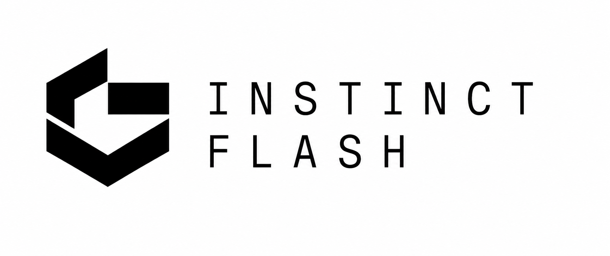

<div align="center">



**A high-performance serving framework for robotics models.**

[](https://www.gnu.org/licenses/agpl-3.0)
[](https://general-instinct.com/)
[](https://www.ycombinator.com/companies/general-instinct)

</div>

---

## Install

```bash
git clone https://github.com/General-Instinct/InstinctFlash && cd InstinctFlash
pip install -e ".[runtime,diffusion,serve]"
```

Python 3.10+. `pip install -e .` alone needs no GPU and is enough to inspect checkpoints;
LingBot-VA needs a CUDA GPU with ~30 GB free.

## Load a model

```python
from instinctflash import Runtime

runtime = Runtime.from_pretrained("robbyant/lingbot-va-posttrain-robotwin")
```

## Get actions

```python
with runtime.episode(prompt="put the bottle in the dustbin") as episode:
    while not done:
        action = episode.predict(observation)
```

`observation` is a dict in the model's own format. That is the whole API — no server to start, no
optimization to choose. If a safety layer changed the action before it reached the robot, pass
`executed_action=...` and the model conditions on what actually happened.

Or over the network — the same msgpack-over-websocket wire protocol the pi0/openpi ecosystem's
robot-side clients already speak, so existing clients connect unchanged
(`pip install openpi-client`):

```bash
instinctflash serve robbyant/lingbot-va-posttrain-robotwin
```

```python
from openpi_client.websocket_client_policy import WebsocketClientPolicy

client = WebsocketClientPolicy("my-server", 8000)
action = client.infer(observation)
```

The prompt rides in the observation; for stateful models a changed prompt starts a new episode
server-side, and a client can say it explicitly with `{"reset": True, "prompt": ...}`.
`--serve.dry_run=true` runs the preflight only — device, declaration and plan from one metadata
file, no weights, no GPU; `--serve.smoke=true` loads, produces one action and exits;
`--serve.viz=true` streams observations, actions and latency to a [Rerun](https://rerun.io)
viewer. A/B two servers with the same `--serve.seed` to compare outputs value-for-value — it
seeds the noise the model draws, which stock serving leaves unseeded. The second and last verb, `instinctflash validate <dir>`, checks a checkpoint is
publishable — and with `--validate.teacher_outcomes / .student_outcomes / .margin` also runs a
paired non-inferiority certificate and stamps it into the package.

## Results

| model | PyTorch → InstinctFlash (H100) | PyTorch → InstinctFlash (Jetson Thor) | tier |
|:--|:--|:--|:--|
| **LingBot-VA** (5B WAM) | 8448 → 2583 ms, **3.27×** | 18027 → 5611 ms, **3.21×** | NUMERIC |
| **LingBot-VA @ 2V/4A** (5B WAM) | 8448 → 360 ms, **23×** | 18027 → 893 ms, **20×** | OPERATING-POINT (certified) |
| **LingBot-VLA-4B** | 671 → 185 ms, **3.62×** | 696 → 97.5 ms, **7.13×** | BITEXACT / engine |
| **LingBot-VLA-V2-6B** (sparse-MoE) | 829 → 183 ms, **4.54×** | 752 → 210 ms, **3.57×** | NUMERIC / engine |
| **Cosmos3-Edge-Policy** (3.86B) | 311 → 186 ms, **1.67×** | 1158 → 660 ms, **1.75×** | NUMERIC |
| **Cosmos3-Nano-Policy** (15.75B) | 482 → 325 ms, **1.49×** | 3956 → 2080 ms, **1.90×** | NUMERIC |
| **pi05** | 207 → 73 ms, **2.84×** | 255 → 57 ms, **4.49×** | BITEXACT / engine |
| **GR00T-N1.7-3B** | 115 → 59 ms, **1.94×** | 122 → 42 ms, **2.88×** | BITEXACT / engine |
| **DreamZero-DROID** (Wan2.2-5B WAM) | 3227 → 1843 ms, **1.75×** | — | SCREEN |

**BITEXACT** means identical actions, **NUMERIC** means a declared-margin result, **SCREEN**
means measured deltas without a closed-loop certificate, and **OPERATING-POINT** means a declared
few-step schedule — changed computation, carried by its own paired closed-loop certificate.

## What's new 🔥

- **Eight model families, two device classes.** Each measured against its authors' own serving
  code on the same device. H100 and Jetson Thor need opposite optimizations — the planner
  measures before it applies. Numbers in the results table above.
- **Declared few-step schedules.** LingBot-VA's 2V/4A schedule runs at twenty-three times its
  upstream serving cost, certified non-inferior over 1153 pre-registered RoboTwin episode
  pairs. A few-step distillation framework is under development as an InstinctFlash component.
- **Bit-exact CUDA-graph capture.** A static max-extent KV buffer makes denoise loops
  capturable with bit-exact replay on unseen inputs — verified on three model families and two
  GPU architectures. Sparse-MoE routing re-executes per replay, never baked.
- **[InstinctCompress](https://github.com/General-Instinct/InstinctCompress)** (customer
  access): a fine-tuned pi05 checkpoint 8.7 GB → 3.2 GB, accuracy trained back on your own
  demonstrations and verified, served through the same stack unchanged.

## Roadmap

- **Few-step distillation.** Train back the small quality cost of declared few-step schedules —
  starting with LingBot-VA's 2V/4A point (−1.65 pp against its teacher today) — and reach
  schedules that untrained reduction cannot, each shipped with its own paired certificate.
- **LingBot-VA on the edge engine.** The fp8 engine tier that serves pi05, LingBot-VLA-4B and
  LingBot-VLA-V2 on Jetson Thor, extended to the VA world-action model.
- **Attention upgrades.** A faster NUMERIC-tier attention arm beside the BITEXACT default for
  pi05-class models; hybrid and linear attention for long-context world models.
- **Cosmos3 engine serving, and DreamZero on the edge** — each after its groundwork
  (reference-implementation alignment; memory footprint on unified-memory devices).

## Framework overview

InstinctFlash keeps model declarations, optimization planning, runtime execution, and evidence in
one inspectable path, whether it is called from Python or the command line.

# Architecture

A checkpoint carries a short declaration of what it is. The runtime reads the declaration, decides
which optimizations are provably valid for those weights, applies them, and shows its work:

```
checkpoint ─▶ adapter          ─▶ planner            ─▶ engine passes        ─▶ actions
              declares what        decides what          apply and measure
              the model is         is valid (no GPU,     each optimization
                                   no weights needed)
```

Optimization is organized in six layers, by what each one changes:

| layer | | changes |
|:--|:--|:--|
| 1 | **MODEL** | what is computed — distillation, step reduction, checkpoint compression ([InstinctCompress](https://github.com/General-Instinct/InstinctCompress), [instinct-pdd](https://github.com/General-Instinct/instinct-pdd)) |
| 2 | **GRAPH** | when work is issued — prefill extraction, CUDA-graph capture, memory planning |
| 3 | **CACHE** | what is recomputed — KV reuse, cross-attention and episode caches |
| 4 | **ATTENTION** | how tokens mix — FlashAttention, hybrid and linear attention |
| 5 | **KERNEL** | how a kernel is written — backend and layout dispatch, fusion |
| 6 | **HARDWARE** | what it executes on — fp8/int8, TensorRT, Jetson-class edge devices ([`serving/`](serving/)) |

Layer 1 changes the *weights* and produces a checkpoint; it lives in the companion repos. Layers
2–6 change *how the weights execute* and produce a plan; they are the runtime in this repo. The
layers are not a priority order — the runtime measures where the time actually goes and starts
there.

## Compress a checkpoint before serving

See
[InstinctCompress](https://github.com/General-Instinct/InstinctCompress) (customer access;
contact founders@general-instinct.com):

```bash
pip install git+https://github.com/General-Instinct/InstinctCompress   # with granted access
pi05-compress compress <checkpoint> out/ --tasks tasks.txt --dataset <your_demonstrations>
```

To add your own model family, declare an `instinctflash.adapters` entry point and `pip install`
your package — see [`examples/external_plugin/`](examples/external_plugin/).
