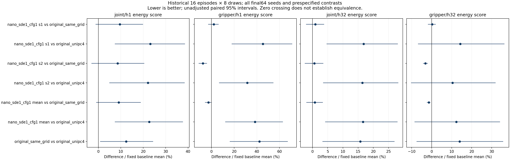

# Audited historical follow-up quality

All prospective comparisons are shown. Negative energy-score differences favor the candidate. Intervals are unadjusted paired episode bootstraps (5,000 replicates); two training seeds are averaged within episode.

| Candidate | Baseline | Joint H1 Δ% | Gripper H1 Δ% | Joint H32 Δ% | Gripper H32 Δ% |
|---|---|---:|---:|---:|---:|
| nano_sde1_cfg1 s1 | original_same_grid | +9.59 [-1.11, +19.77] | +2.08 [-2.76, +6.08] | +0.96 [-2.01, +3.72] | +0.25 [-1.74, +1.93] |
| nano_sde1_cfg1 s1 | original_unipc4 | +23.19 [+7.51, +38.49] | +45.31 [+18.08, +71.00] | +16.84 [+4.73, +27.96] | +14.26 [-6.72, +36.25] |
| nano_sde1_cfg1 s2 | original_same_grid | +8.64 [-2.93, +20.37] | -7.61 [-11.05, -4.28] | +0.60 [-2.42, +3.47] | -3.11 [-4.14, -2.08] |
| nano_sde1_cfg1 s2 | original_unipc4 | +22.13 [+5.01, +38.39] | +31.51 [+6.86, +54.47] | +16.42 [+3.57, +28.15] | +10.43 [-10.20, +31.78] |
| nano_sde1_cfg1 mean | original_same_grid | +9.11 [-0.79, +18.81] | -2.77 [-5.48, -0.19] | +0.78 [-1.93, +3.30] | -1.43 [-2.27, -0.75] |
| nano_sde1_cfg1 mean | original_unipc4 | +22.66 [+7.50, +37.58] | +38.41 [+12.27, +62.71] | +16.63 [+4.28, +27.86] | +12.34 [-8.45, +33.99] |
| original_same_grid | original_unipc4 | +12.41 [+0.92, +24.28] | +42.35 [+16.36, +67.13] | +15.73 [+3.39, +26.91] | +13.97 [-7.41, +35.58] |

The interval endpoints above are absolute bootstrap differences divided by the fixed full-panel baseline mean; they are not separately bootstrapped percentage ratios.

Historical16 episodes K8; two seeds averaged within episode.
Unadjusted paired bootstrap intervals; no noninferiority/equivalence or checkpoint selection.
Teacher32 is a separate reference, not ground truth or a deployment candidate.
Native H100 quality does not admit Thor numerical/cache paths or closed-loop realtime.
